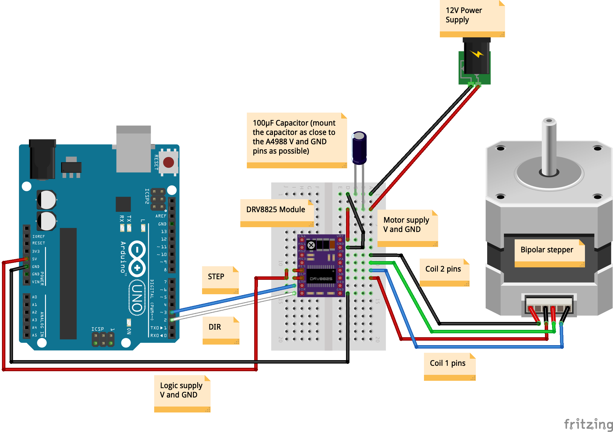
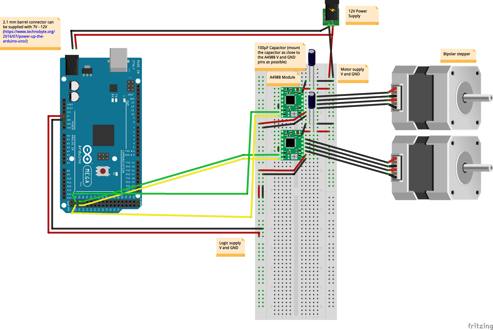
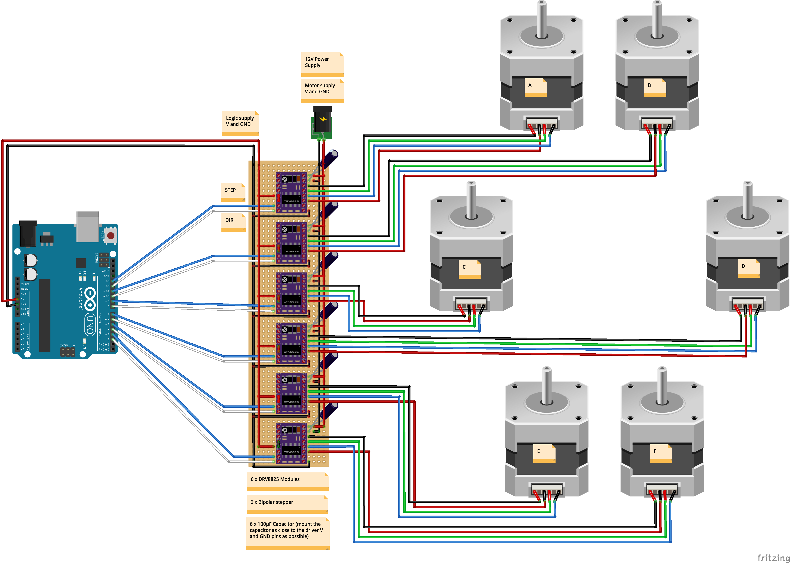

# arduino-stepper-motor
Scripts to use for controlling stepper motors

Wiring diagram - basic setup, with an A4988 driver:

Wiring diagram - basic setup, with a DRV8825 driver:

Wiring diagram - control a stepper motor using a rotary encoder (with built-in push button):

Wiring diagram - control a stepper motor using a rotary encoder and 2 limit switches:

Wiring diagram - control multiple stepper motors with A4988 drivers:

Wiring diagram - control multiple stepper motors with DRV8825 drivers:

