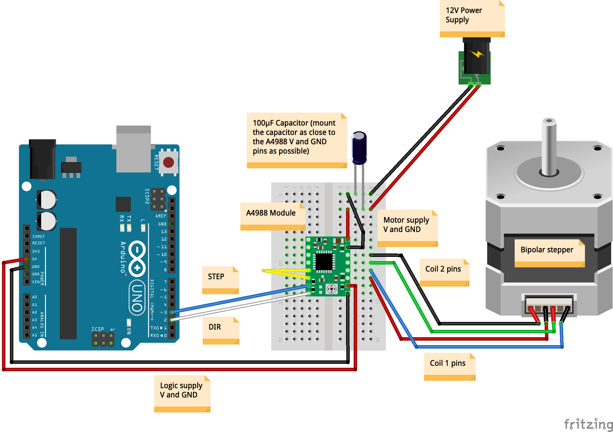

# arduino-stepper-motor
Scripts to use for controlling stepper motors

Wiring diagram - basic setup:

Wiring diagram - control stepper motor using a rotary encoder with built-in push button:

Wiring diagram - control stepper motor using a rotary encoder and 2 limit switches:

Wiring diagram - control multiple stepper motors:

